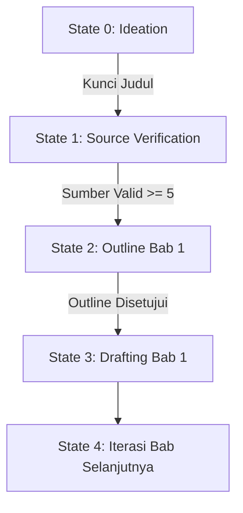

# UHN Academic MCP Agent - System Architecture

## 1. Context Governance (Reject Figma/Miro)
Visual tools (Miro/Figma) menciptakan *Semantic Gap*. Agen AI tidak dapat membaca kanvas visual secara deterministik. 
**Best Practice:** Gunakan *Markdown-based PRD* dan *State Trees* di dalam direktori `docs/` atau `.cursorrules`. Konteks harus berupa teks terstruktur (YAML/Markdown) agar *Agentic Density* maksimal dan token hemat (*Caveman Compression*).

## 2. Core Architecture: Stateful Graph (LangGraph Pattern)
Agen biasa akan berhalusinasi dan melompat dari "Diskusi Judul" langsung ke "Bab 1". Untuk mencegahnya, sistem percakapan tidak boleh diserahkan 100% ke LLM. Kita menggunakan *Stateful Graph Routing*:

*LLM hanya diizinkan memanggil *tools* yang tersedia pada *State* aktif.*

## 3. Topologi MCP Servers (Model Context Protocol)
Aplikasi Next.js Anda (Frontend) akan bertindak sebagai *Client*. Kita butuh 3 MCP Server terisolasi:

1. **`mcp-academic-verifier`**
   - **Tugas:** Menyelam ke API eksternal (Google Scholar, CrossRef, DOAJ).
   - **Aturan Mutlak:** Jika jurnal tidak ditemukan di API, agen wajib menjawab "Sumber tidak valid/fiktif". Mencegah halusinasi referensi.
2. **`mcp-guideline-rag` (Semantic RAG)**
   - **Tugas:** Membaca dokumen Pedoman Skripsi/KP UHN.
   - **Mekanisme:** RAG vektor lokal (Pinecone/Postgres pgvector) agar agen tahu persis margin, font, dan struktur baku kampus.
3. **`mcp-doc-builder`**
   - **Tugas:** Menyusun memori percakapan menjadi dokumen nyata (.docx / .pdf).
   - **Mekanisme:** Menggunakan *CRDT (Conflict-Free Replicated Data Type)* jika memungkinkan, agar agen bisa merevisi Bab 1 tanpa merusak keseluruhan dokumen.

## 4. Tumpukan Teknologi Terpilih
- **Frontend/Orchestrator:** Next.js (sudah *deploy* di Vercel).
- **Agent Framework:** LangGraph (JS/TS version) untuk manajemen *state* siklikal.
- **MCP Transport:** SSE (Server-Sent Events) via `/api/mcp` routes di Next.js.
- **LLM Engine:** API Gemini diakses via Vercel AI SDK dengan *tool calling* ketat.
